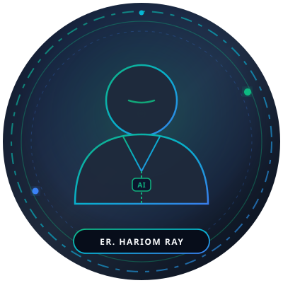

# Er. Hariom Kumar Ray - Premium Personal Portfolio & Digital Profile

A high-performance, mobile-first, and modern personal website built for **Er. Hariom Kumar Ray** (Computer Science & Artificial Intelligence Engineer).

Engineered to serve as a standout **Instagram Bio link**, digital identity card, and personal portfolio showcasing engineering competence, projects, research, and future entrepreneurial vision.

---

## Key Highlights

- **Identity Card + Portfolio**: Optimized for smartphone visitors opening directly from Instagram or LinkedIn.
- **Design System**: Deep obsidian navy (`#070B14`), emerald green (`#10B981`), electric blue accents, subtle glassmorphism, and soft shadows.
- **Zero-Dependency & Instant Load**: Pure semantic HTML5, modern CSS variables, and vanilla JavaScript.
- **Comprehensive Sections**:
  1. **Sticky Header**: Responsive with mobile navigation drawer and active ScrollSpy.
  2. **Hero Section**: Prominent title, verified badge, triple identity tags, personal quote, action buttons, and circular glass photo frame.
  3. **Quick Introduction**: "Hello, I'm Hariom 👋" with key metadata cards (Semester, Branch, College, Location).
  4. **Education**: B.Tech CSE (AI) at Government Engineering College, Munger with timeline card.
  5. **Technical Skills**: Real skill chips organized by category (Languages, AI/ML, Core CS, Databases). No fake percentages.
  6. **Projects**: Featured showcase of **Mushibat Healthcare** with interactive 6-feature grid and modal architecture drawer.
  7. **Experience & Certifications**: Factual cards for IIIT Bhagalpur research internship, TING Works LLP, Cisco Networking Academy, and Codec Technology.
  8. **Currently**: Live status beacon with learning and building tags.
  9. **My Vision**: Signature high-contrast founder-mindset card.
  10. **Let's Connect**: Social cards (Instagram, LinkedIn, GitHub, Email) with 1-click clipboard copy.
  11. **Footer**: Clean branding and dynamic copyright year.

---

## How to Customize

### 1. Change Profile Picture
1. Copy your photo into the `assets/` folder (e.g. `assets/hariom.jpg`).
2. In `index.html`, find the line:
   ```html
   
   ```
3. Update it to:
   ```html
   
   ```

### 2. Update Social Links & Email
In `index.html`, search for `<!-- REPLACE href WITH YOUR... -->` and update the `href` attributes for:
- Instagram: `https://instagram.com/your_handle`
- LinkedIn: `https://linkedin.com/in/your_profile`
- GitHub: `https://github.com/your_username`
- Email: `mailto:your_email@example.com`

---

## Free 1-Minute Deployment Options

### Option 1: GitHub Pages
1. Push this folder to a GitHub repository named `hariom-portfolio` (or `<username>.github.io`).
2. Go to **Settings** > **Pages** > select branch `main` and root `/`.
3. Save. Your site will be live at `https://<username>.github.io/`!

### Option 2: Vercel / Netlify
1. Drag and drop the `hariom-portfolio` folder directly into [Vercel](https://vercel.com) or [Netlify](https://netlify.com).
2. Deploys instantly with free SSL and lightning CDN.
